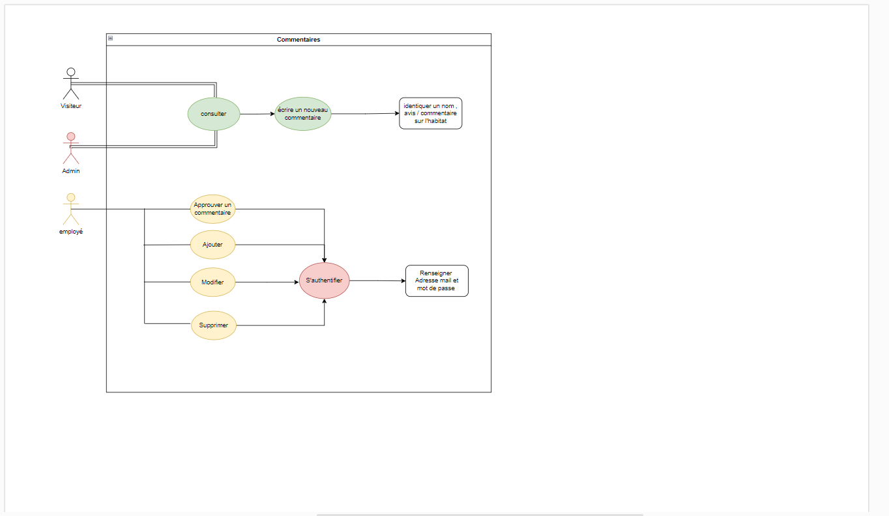
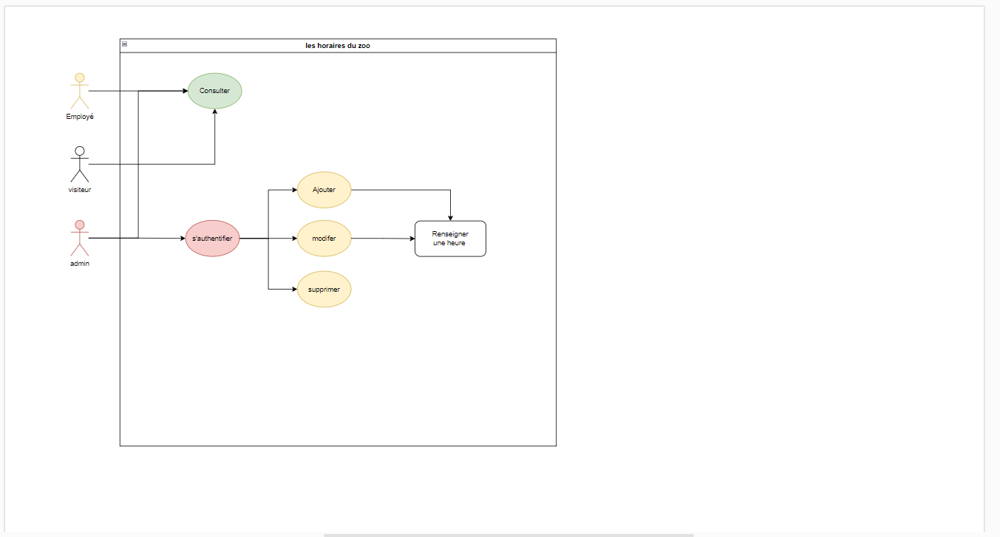
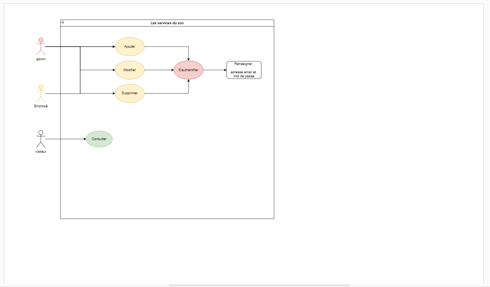
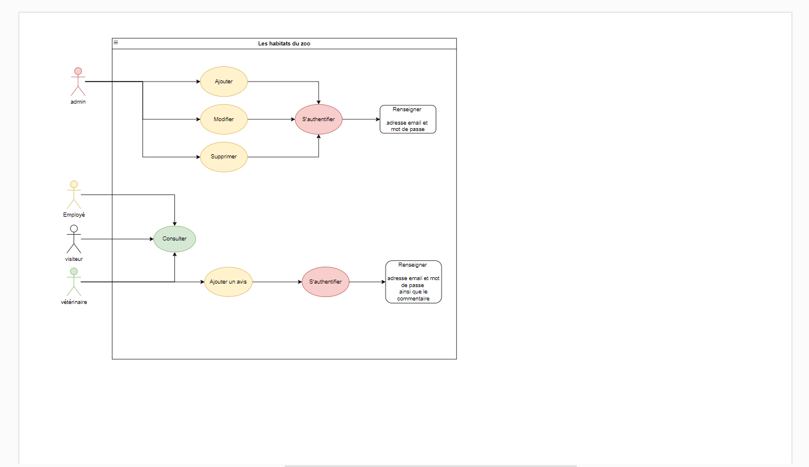
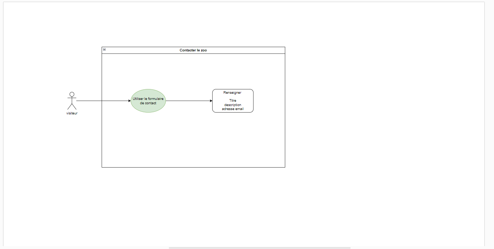
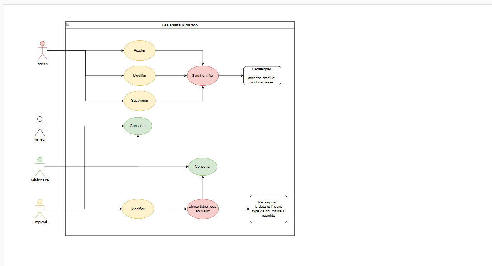
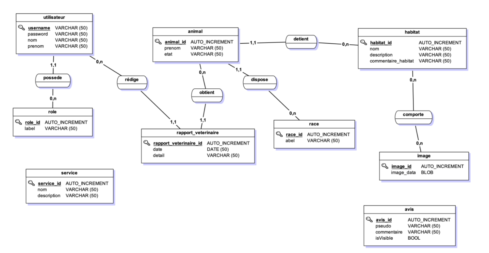

# ÉVALUATION EN COURS DE FORMATION
## Graduate Développeur
###### (Android, Angular, Flutter, Front End, Full Stack, IOS, PHP/Symfony)

---

## Énoncé

**Votre examen comporte :**

✔ Cet énoncé qui vous présente le sujet de l’épreuve

✔ Une copie à rendre (Excel ou Word) que vous devez télécharger, remplir informatiquement et déposer dans l’espace de dépôt prévu à cet effet.


**Renommer votre copie à rendre Word ou Excel comme suit :**
TP_DWWM_Sept/Oct/Nov/Déc24/Janv/Févr/Mars/Avril25_copiearendre_NOM_Prenom

**Objectifs de l’évaluation :**
L’évaluation en cours de formation que vous allez réaliser a pour vocation de figurer dans votre livret d’évaluation. Il sera donc remis à votre jury le jour des épreuves du titre professionnel accompagné de votre évaluation et du sujet initial.
Nous vous demandons de vous mettre en situation d’examen. Prenez le temps de lire le sujet et de manipuler les annexes afin de répondre en situation professionnelle aux questions et problématiques évoquées dans le sujet


### À vous de jouer !

## Informations

**Github** : https://github.com/codealex1/ECF_GRADUATE_DEV2024.git

**Démonstration** : <span style="color:red">**url du site**</span>

    Adresse email admin      : admin@josearcadia.com
    Mot de passe admin       : Admin123!

    Adresse email employé      : employe@arcadiaemploye.com
    Mot de passe employé       : Employe123!

    Adresse email vétérinaire      : veterinaire@arcadiaveterinaire.com
    Mot de passe vétérinaire       : Veterinaire123!

## Réflexion et configuration de l'environement de travail 

### Git et Github

Pour commencer, j'ouvre **un nouveau "Repository"** dans mon espace **Github** que je nomme **ECF-GRADUATE_DEV2024**.
Une fois celui-ci configuré, j'**initialise Git** en utilisant les commandes ci-dessous:

```bash
$ git init
$ git add .
$ git commit -m "first commit"
$ git branch -M dev
$ git remote add origin https://github.com/codealex1/ECF_GRADUATE_DEV2024_ALEXANDRE_BRUNET.git
$ git push -u origin dev
```

### <span style="text-decoration:underline">Déploiement local</span>

commencez par cloner le repository à l'aide de la commande git clone https://github.com/codealex1/ECF_GRADUATE_DEV2024_ALEXANDRE_BRUNET.git

Rendez-vous dans le dossier FrontEnd , installer les dépendances avec npm install
puis direction le index.html  , grace à l'extention php Server de Vs code clic droit , php serve project

Ensuite allez dans le dossier backend , ouvrer le terminal , puis exécuter la commande composer install . 

Créer un fichier .env.local et configurer l'url de votre base de donée et de votre service d'envoie de mail (mailtrap utlisé lors du développement)

Une fois les dépendances installées , exécuter la commande php -S 127.0.0.1:8000 -t public pour lancer l'API en local .

Enfin , rentrez comme url api/doc et le tour sera joué . 


**Trello** : <span style="color:red">**url du trello**</span>


### <span style="text-decoration:underline">Configuration de l'environement de travail</span>


- **Serveur:**
    + Apache
    + PHP 8.1
    + MySQL 8.1 / PDO


- **Backend (API)**
    + PHP 8.1
    + MySQL 8.0 / PDO
    + Symfony 7


- **Frontend**
    + HTML 5
    + CSS 3
    + Javascript
    + ReactJs


## Diagramme des Cas d'utilisations

<br />








<br /><br />

<br /><br />
## Modélisation des données




